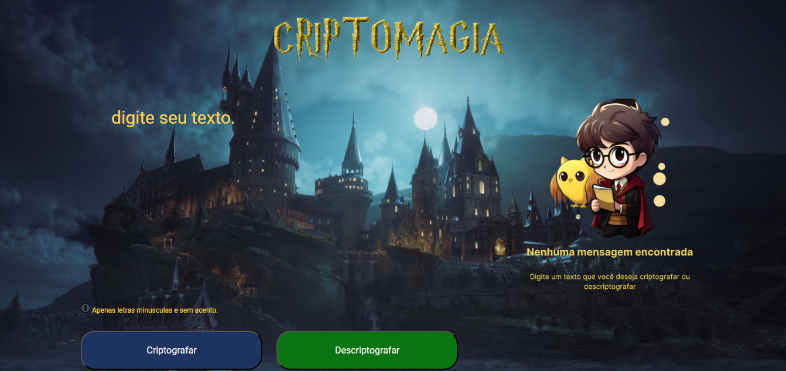

# Decodificador de Texto - Tema Harry Potter

Este é um projeto de decodificação de texto com o tema Harry Potter. 
Ele permite que os usuários criptografem e descriptografem mensagens usando um algoritmo específico. 

Veja que legal como fica a página inicial :

## Ferramentas utilizadas:

* HTML

* CSS

* JavaScript

## Funcionalidades

- Criptografar texto inserido pelo usuário.
- Descriptografar texto criptografado anteriormente.
- Interface de usuário intuitiva e responsiva.

## Feito por:

### Victor Ferreira Rossini

### Linkedin: https://www.linkedin.com/in/victor-ferreira-rossini-8903ab204/
